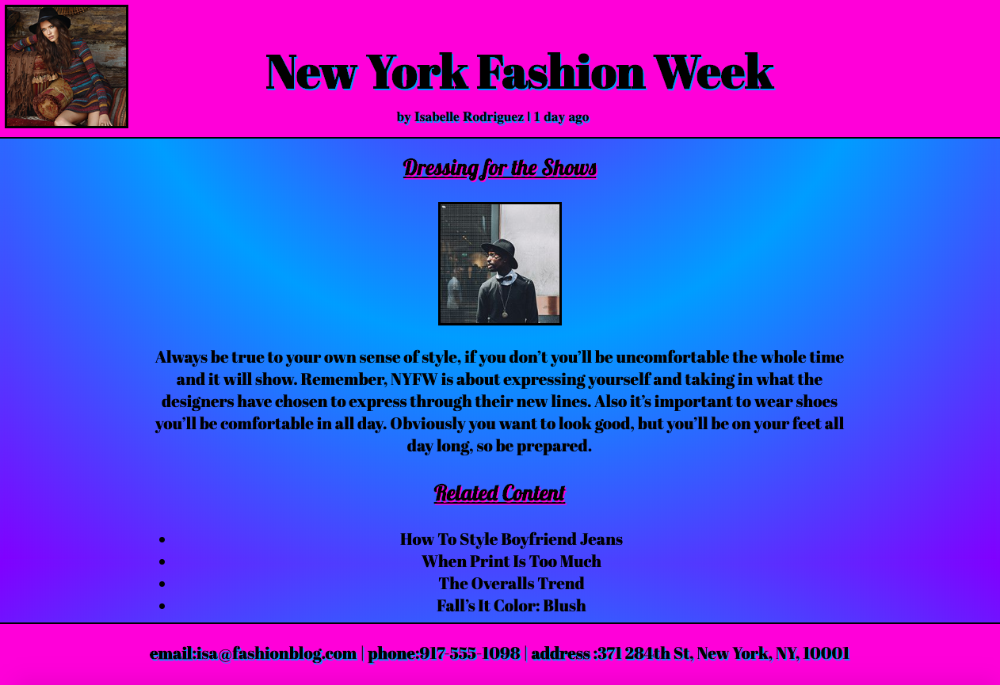

# Fashion-blog

### **Description:**
This is a fictional website for a fashion blogger. Relevant information about New York Fashion Week is displayed. The website was created to practice the concepts of 'fixed headers and fixed footers' using HTML positioning techniques. It was styled with using CSS and Google-Fonts to make it look a bit more appealing.  
 

_____

### **Instructions for Viewing**
* This Website can be viewed by simply opening it in any browser. 
 
_____

### **Demo Screenshots**
##### Fashion Blog
* The Website!

 
_________

### **Technologies Used**
* HTML5
* CSS
* Google-Fonts
 
_____

### **Built With**
* Visual Studio Code
